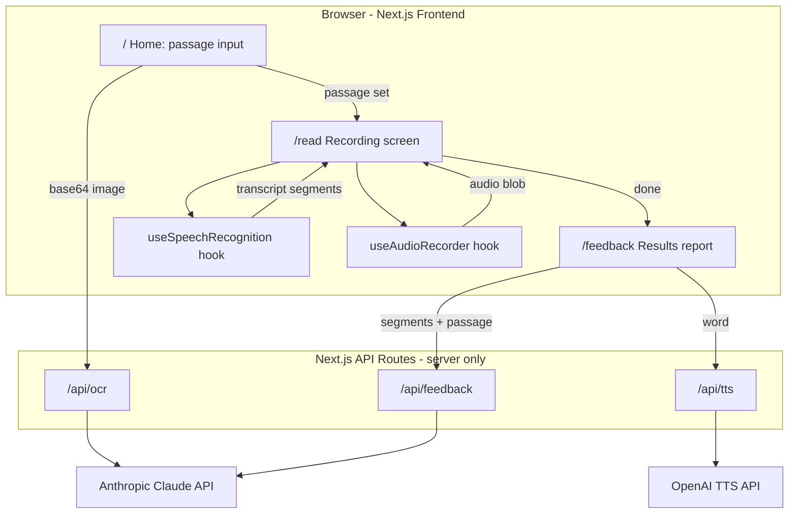

# ReadCoach Build Plan

## Goal
A mobile-friendly web app: input a passage (paste / photo OCR / sample), read it aloud while the browser transcribes, then get a structured AI feedback report on pronunciation.

## Architecture

## Key technical decisions
- **State between pages**: passage, transcript, and timing data held in a React Context backed by sessionStorage — no backend, no accounts.
- **Long recordings**: `useSpeechRecognition` auto-restarts recognition in its `onend` handler; finalized transcript segments append to a running total.
- **Voice recording**: `useAudioRecorder` runs `MediaRecorder` in parallel with speech recognition. The audio blob is ephemeral (Blob URL, not persisted to sessionStorage). Flagged words play back the segment of audio containing the word.
- **Correct pronunciation**: `/api/tts` route calls OpenAI TTS with a fixed voice so every word sounds identical across all browsers. No browser-native TTS inconsistencies.
- **API key security**: `ANTHROPIC_API_KEY` and `OPENAI_API_KEY` live in `.env.local`; only API routes call external services.
- **Chunking**: transcripts >~400 words are aligned and split against the passage; per-chunk Claude calls return structured JSON merged into one report.
- **Browser support**: Chrome/Edge/Brave fully; graceful "browser not supported" notice elsewhere (Firefox lacks Web Speech API).

## Completed steps

### Step 0 — Project setup (done)
Scaffold Next.js 14 (App Router, JS, Tailwind), folder structure, `.env.local` placeholder, README.

### Step 1 — Passage input screen (done)
Three input tabs: paste textarea, image upload (-> base64 -> `/api/ocr` -> editable extracted text), sample picker. OCR uses Claude with a strict system prompt to extract verbatim text.

### Step 2 — Recording engine (done)
`useSpeechRecognition` hook: start/stop, auto-restart loop, interim + final transcript accumulation, per-segment timestamps. UI: passage display, pulsing record indicator, timer, live 5-line transcript window, stop -> stats + "Get Feedback" button.

### Step 3 — Feedback API route (done)
`/api/feedback` — accepts segments + passage, calls Claude for pronunciation analysis. Short transcripts use a single call; long transcripts fan out in parallel chunks then merge. Returns structured JSON with scores, flagged words, and next steps.

### Step 4 — Feedback report UI (done)
Loading state, pronunciation score card with SVG ring, flagged word cards with audio playback buttons, next steps, retry/new passage actions.

## Current steps

### Step 5A — Voice recording with MediaRecorder
Record the user's actual voice during the reading session so flagged words can play back the user's real pronunciation.

**Files to create/modify:**
1. **`hooks/useAudioRecorder.js`** (new) — wraps MediaRecorder. Starts/stops alongside speech recognition. Collects audio chunks, combines into a Blob on stop, exposes `audioUrl` and `recordingStartTime`.
2. **`lib/store.js`** (modify) — add `audioUrl` and `recordingStartTime` to context. NOT persisted to sessionStorage (Blob URLs are ephemeral). `resetSession()` revokes the old URL.
3. **`app/read/page.js`** (modify) — use `useAudioRecorder` alongside `useSpeechRecognition`. Start/stop both together. Save audio data to store on "Get Feedback".
4. **`app/feedback/page.js`** (modify) — `FlaggedWordCard` "How you said it" button: find segment containing the word, seek full recording to `(segment.start - recordingStartTime) / 1000` seconds, play for segment duration. Hide button if audioUrl is null (page refresh).

- **Done when**: user records a passage, gets feedback, clicks "How you said it" on a flagged word, and hears their own voice saying the relevant sentence.

### Step 5B — Uniform TTS via OpenAI
Replace inconsistent browser TTS and dictionary API with a single, uniform voice for correct pronunciation playback.

**Files to create/modify:**
1. **`.env.local` / `.env.example`** (modify) — add `OPENAI_API_KEY`.
2. **`app/api/tts/route.js`** (new) — accepts `{ word }`, calls OpenAI TTS REST API (`POST https://api.openai.com/v1/audio/speech`) with fixed voice "alloy" and model "tts-1", returns base64 audio.
3. **`app/feedback/page.js`** (modify) — `FlaggedWordCard` "Correct" button: call `/api/tts`, play returned audio, cache in state for repeat clicks. Remove Free Dictionary API and browser speechSynthesis.

- **Done when**: every "Correct" button plays the same clear voice regardless of browser or device.

## Remaining

### Step 6 — Polish and deploy
Error states (mic denied, unsupported browser, API failures), mobile layout pass, loading/empty states, deploy to Vercel with env vars set.
- **Done when**: the production Vercel URL completes the full journey on a phone.

## Definition of project completion
- All three passage-input methods work, including OCR.
- A 10+ minute reading records without interruption.
- Feedback report shows pronunciation score with specific, passage-grounded findings.
- Flagged words play back the user's actual voice and a uniform correct pronunciation.
- API keys never reach the browser.
- Deployed and usable on a mobile browser via the Vercel URL.

## Out of scope (confirmed)
Accounts/history, intonation analysis, live word highlighting, native mobile app, punctuation/pause analysis.
